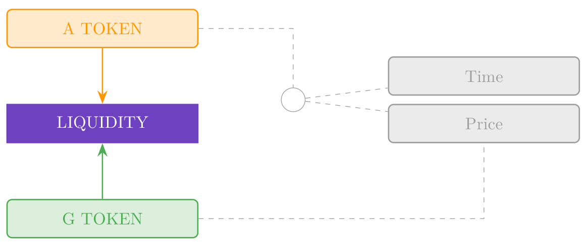

# Klima 2.0

<p class="u-center">dark_sole<br>ds@darksole.vip
<p class="u-center">With contributions from scott@klimadao.finance
<p class="u-center">March 11, 2025
<p class="u-center">
<p class="u-center">Autonomous Asset Manager, Liquidity and Bond Markets powered
by a Dual Token structure designed for efficient and rational decentralised
liquidity in the carbon offset markets.
<p class="u-center">Version 1.21
<p class="u-center">
<table class="Copyright">
  <tr class="Copyright-row">
    <th class="Copyright-cell">Copyright Notice</th>
  </tr>
  <tr class="Copyright-row">
    <td class="Copyright-cell">This document represents original work by
    dark_sole ds@darksole.vip. While contributions from others are gratefully
    acknowledged, all intellectual property rights remain with the author. The
    models, algorithms, processes, products, methodologies, and concepts
    described herein are licensed exclusively for commercial use by Klima DAO.
    No other party may implement, copy, modify, or derive works from these
    materials without explicit written permission from the author.</td>
  </tr>
  <tr class="Copyright-row">
    <td class="Copyright-cell">© 2025 dark_sole. All rights reserved.</td>
  </tr>
</table>

## 1 Introduction

Klima DAO was conceived to create market infrastructure driving seamless
liquidity for Carbon monetisation and Carbon retirement. It has been constructed
using decentralised architecture with a token system 'KLIMA' for dynamic
economic governance. Whilst it has been successful in brand and customer
acquisition, as well as acquiring real Carbon assets, the current token model
and processes are unwieldy and will not allow the product to scale to its
potential given the opportunity.

Hence we present **Klima 2.0** as a fundamental capital, liquidity and execution
layer for wholesale Carbon trading.

### 1.1 Client base

There are two end-users of the platform that create the supply and demand of
Carbon assets.

1. **Sellers** wishing to capitalise liquid or
<span class="u-underline">forward</span> delivery classes of Carbon.
Forward-delivery trades at various discounts as a function of class and time.

2. **Buyers** who wish to retire Carbon in order to obtain the offset credit.

### 1.2 Automated Asset Manager

Both clients are facilitated through the Automated Asset Manager (**AAM**), a
smart contract based system that continuously acquires (tokenised) Carbon, as
well as selling offset certificates from its liquid Carbon portfolio, using the
native **capital token** as a medium of exchange.

<p class="u-center">Figure 1: Automated Asset Manager (AAM) Transaction Flow


### 1.3 Dual tokens

The Klima economy shall be powered by two tokens:

1. Capital or **Asset token** as detailed above that determines Carbon class
capital allocation by the AAM and the general forward (discount) curve for
Carbon assets. These tokens are used to buy and sell Carbon as in Figure 1.

2. A **Risk Governance** token that combines with the capital token to shape the
risk profile of the underlying Carbon portfolio.

The new tokens are named `KLIMA` and `KLIMAX` respectively, noting that the
original token name carries through to the Asset Token reflecting the original
utility. For the purposes of the document we shall refer to these tokens as
${tex`A`} and ${tex`G`} where brevity is required.

### 1.4 Core Economic Pillars

In addition to the AAM, there are two other tenets of Klima 2.0 that enable the
model to find equilibrium through continous dynamic feedback loops. Importantly
these are generated solely from token balances in the smart contracts and there
is no oversight nor a centralised discretionary actor.

1. **AAM**: The Automated Asset Manager swaps its own token ${tex`A`} for Carbon
${tex`C`} (in) or Carbon offset certificates ${tex`C^∗`} (out) to build a
portfolio of Carbon.

   - Both ${tex`A`} and ${tex`G`} are also used as 'Staking' tokens in the AAM
   whereby ${tex`A`} determines the weighting of any given Carbon class, and
   ${tex`G`} determines the rate of acquisition (disposal).

   - Forward-delivery Carbon (for a set of fixed dates out to 10 years) is
   transacted simultaneously with liquid Carbon.

2. **Bond Market**: ${tex`A`} holders stake tokens until a set expiry to create
floating yield bonds.

   - The collective temporal staking pattern produces a yield curve to reward
   bond-holders as well as price the forward curve for the AAM.

   - Only ${tex`A`} tokens participate in the Bond Market which is responsible
   for pricing the cost of **illiquidity**.

3. **Liquidity Market**: Here the tokens are traded in 2 core liquidity pairs
with various incentives available to Liquidity Provider token holders (**LPs**),
including a **risky-yield** generated by the Bond Market.

   - ${tex`\overline{AG}`}: Native token swap ${tex`A`} and ${tex`G`}.

   - ${tex`\overline{AQ}`}: The asset token ${tex`A`} with USDC ${tex`Q`}.

   The Liquidity Market provides the complementary facility to the Bond Market
   and the critical relationship between the native tokens and the hard currency
   of USDC.

<p class="u-center">Figure 2: Market Architectures, Token Utility


The Klima 2.0 system enables each participant in the various economic pillars to
act in the (selfish) interests of their own capital and utility, which through
the harmonic model, enables price discovery, liquidity and stability for Carbon
trading which feeds back on itself as a catalyst for growth and scale.

### 1.5 Initialisation of the `KLIMA` Asset Token:

Klima DAO has approximately 20 million tonnes of **Carbon** credits in its
treasury as assets which will be used to create the initial issuance of
${tex`A`} tokens upon launch of Klima 2.0.

### 1.6 User Experience

A summary of user functionality:

- AAM
   - Tokenise Carbon that is liquid or forward-delivery to create ${tex`C`}
   tokens.
   - Swap Carbon ${tex`C`} (liquid and forward) for ${tex`A`} tokens.
   - Swap ${tex`A`} tokens ${tex`A`} for liquid Carbon offset certificate
   ${tex`C^∗`}.
   - Stake ${tex`A`} tokens for specific Carbon classes to contribute to the
   underlying portfolio weighting and pricing.
   - Stake ${tex`G`} tokens for specific Carbon classes to contribute to the
   underlying portfolio pricing and capacity.

- Bond Market
   - Stake ${tex`A`} tokens for set maturities to create Bonds and receive
   yield.

- Liquidity Market
   - Swap ${tex`A`} tokens for ${tex`G`} or USDC ${tex`Q`} in the Liquidity
   Market.
   - Swap ${tex`G`} tokens for ${tex`A`} in the Liquidity Market.
   - Add ${tex`A`} tokens, ${tex`G`} tokens or USDC ${tex`Q`} to liquidity pools
   and stake LP tokens to receive fees and a share of ${tex`G`} incentives and
   ${tex`A`} yield.

## 2 Economic System
The customer activity is managed through a smart contract asset manager driven
by staking choices from the token system, the balances of assets held, and the
discount curves generated by the bond market.

<p class="u-center">Figure 3: Autonomous Asset Manager - Detailed Architecture


The AAM is a smart contract exchange platform that facilitates:

1. The sale of Carbon in return for newly issued ${tex`A`} tokens.

2. The issuance of retirement certificates to burn ${tex`A`} tokens.

The combined staking of ${tex`A`} and ${tex`G`} Tokens creates a dynamic pricing
matrix by class of Carbon, and by time, enabling spot and forward trading of
Carbon.

## 3 Two Token Model

The current token is deprecated and replaced with two new tokens:

<p class="u-center">Figure 4: Token Derivation Structure


${tex`A`} is issued autonomously to acquire Carbon and is a tokenised
representation of the underlying Klima Carbon portfolio. It is also minted to
pay Bond yields and Risky Yield for LPs, and is burnt when Carbon certificates
are purchased.

The ${tex`A`} token has <span class="u-underline">2 independent</span> staking
functions:

<p class="u-center">Figure 5: Asset Token Staking Dimensions


1. **Price**: Collective selection of Carbon classes by ${tex`A`} staking
determines the instantaneous price ratio for ${tex`A`} token issuance. This
stake can be amended and withdrawn at any time to allow price modulation for the
platform of its Carbon assets.

2. **Time**: The ${tex`A`} token is locked for a specific period of time
representing a liquidity preference for the holder in return for yield. This
part of the stake cannot be amended.

The ${tex`G`} token has a <span class="u-underline">single</span> staking
function that also selects Carbon classes. This determines the rate of issuance
or price curve of ${tex`A`} for the specified Carbon, as well as the retirement
burning rate.

Both tokens facilitate the Klima Carbon market to function efficiently with the
${tex`A`} token responsible for portfolio selection and pricing, and the
${tex`G`} token modulating capacity and risk.

<p class="u-center">Table 1: Token Summary

| Token                    | Amount      | Notes                                                            |
|:------------------------ |:----------- |:---------------------------------------------------------------- |
| `KLIMA` ${tex`A`} Token  | 20 million  | Supply expands and contracts perpetually.                        |
|                          |             | 87.5% of initial supply available to existing KLIMA holders.     |
|                          |             | Initially created on 1:1 basis with Carbon Tonnes held.          |
|                          |             | Issues on Carbon received, and Burns on Carbon retired.          |
|                          |             | _Sets portfolio weights for Carbon classes_                      |
|                          |             | _Sets discount curve for foward pricing_                         |
| `KLIMAX` ${tex`G`} Token | 100 million | Fixed supply                                                     |
|                          |             | 40% put into programmatic issuance as incentive yield over time. |
|                          |             | 40% for existing KLIMA holders                                   |
|                          |             | _Sets capacity-price curve for Carbon classes_                   |
|                          |             | _Sets retirement spread for Carbon offsets_                      |

## 4 Bond Market

Holders of ${tex`A`} can stake (select) a bond maturity from the set of
**standard maturities**. Bonds expire every 90 days on a rolling basis. There
are always 40 maturities extending out to approximately 10 years for bond
staking.

- Collective Bond staking detemines the shape of the discount curve of the
${tex`A`} token with regards to its purchasing rate of forward Carbon

- Bondholders receive a floating yield of new ${tex`A`} tokens on their stake
following the shape of this discount curve. Yield is calculated daily and
accumulates to the principal stake.

- There is no un-staking and all principal and accumulated yield is released at
bond maturity.

${tex`G`} Tokens are not involved in the bond market and the forward curve is
agnostic to Carbon class (as Carbon selection for portfolio weighting is an
independent utility function of ${tex`A`}).

### 4.1 Bond Market Calculations

Defining:

- ${tex`S`}: Total ${tex`A`} tokens staked for Bonds expressed as a proportion
of outstanding supply of ${tex`A`}.

- ${tex`S_t`}: Total ${tex`A`} tokens staked for each Bond maturity bucket
${tex`t`}, expressed as a proportion of outstanding supply of ${tex`A`}, where
${tex`\sum S_t = S`}, and ${tex`t`} is the index of standard maturities
${tex`t \in \{ 1, 2, \dots, 40 \}.`}

- ${tex`E_t`}: Time to expiry expressed in years.

```js
function constAreaLinear(range, area, inputSlope, slopeFactor = 0.007) {
  if (range.length === 1) {
    return [area];
  }

  let y1 = 0;
  let y2 = range.length - 1;
  let slope = slopeFactor * Math.atanh(inputSlope);
  let intercept = area / range.length;

  if (Math.abs(slope) > 2 * intercept / (y2 - y1 - 1)) {
    const yExactShift = Math.sqrt(Math.abs(2 * area / slope));
    const yRoundShift = Math.max(1, Math.round(yExactShift));
    if (slope > 0) {
      y1 = y2 - yRoundShift;
    } else {
      y2 = y1 + yRoundShift;
    }
    slope = Math.sign(slope) * 2 * area / Math.pow((y2 - y1), 2);
    intercept = Math.abs(slope) * (y2 - y1 - 1) / 2;
  }

  const yConstArea = [];
  for (let i = 0; i < range.length; i++) {
    const y = i - (y1 + y2) / 2;
    yConstArea.push(Math.max(0, slope * y + intercept));
  }

  return yConstArea;
}
```

```js
const vecE = d3.range(0.25, 10.1, 0.25);

const scaleE = d3.scaleLinear(d3.extent(vecE), [-1, 1]);

const vecS = constAreaLinear(vecE, inputS, scaleE(inputD));

const vecReverseCumsumS = d3.cumsum(vecS.slice().reverse()).reverse();
```

Calculating curve parameters ${tex`D`}, ${tex`C`}:

```tex
D = \frac 1 S \sum_{t=1}^{40} S_t E_t \tag{1}
```

```js
function dotProduct(v, w) {
  if (v.length !== w.length) {
    throw new Error("Vectors must have the same length");
  }
  return v.reduce((acc, val, i) => acc + val * w[i], 0);
}

function weightedArithmeticMean(v, weights) {
  return dotProduct(v, weights) / d3.sum(weights);
}
```

```js
const paramD = weightedArithmeticMean(vecE, vecS);
```

```tex
C = \frac 1 S \sum_{t=1}^{40} S_t E_t^2 \tag{2}
```

```js
const paramC = weightedArithmeticMean(vecE.map(e => e * e), vecS);
```

The shape of the yield curve ${tex`\gamma_t`} is produced:

```tex
\gamma_t = \max \left( \frac{E_t}{D} - \frac{E_t^2}{2 C}, 0 \right) \tag{4}
```

```js
function computeGamma(vecE, paramD, paramC) {
  const twoC = 2 * paramC;
  return vecE.map(e => Math.max(0, e/paramD - e*e/twoC));
}
```

```js
const vecGamma = computeGamma(vecE, paramD, paramC);
```

Normalising ${tex`\gamma_t`} to ${tex`\hat\gamma_t`}:

```tex
\hat\gamma_t = \frac{\gamma_t}{\sum_{t=1}^{40} \gamma_t} \tag{4}
```

```js
function normalize(v) {
  const sum = d3.sum(v);
  return v.map(val => val / sum);
}
```

```js
const vecNormGamma = normalize(vecGamma);
```

With the cumulative sum of the normalised values be expressed as
${tex`\Gamma_t`}:

```tex
\Gamma_t = \sum_{i=1}^t \hat\gamma_i \quad \text{for } t = 1, \dots, 40 \tag{5}
```

```js
const vecCumSumGamma = d3.cumsum(vecNormGamma);
```

The zero coupon yield curve ${tex`Z_t`} is solved:

```tex
Z_t = (1-S) \frac{\Gamma_t}{E_t} \tag{6}
```

```js
function computeZ(paramS, vecCumSumGamma, vecE) {
  return vecCumSumGamma.map((g, t) => (1 - paramS) * g / vecE[t]);
}
```

```js
const vecZ = computeZ(inputS, vecCumSumGamma, vecE);
```

Finally, the Bond discount rate ${tex`B_t`} is derived:

```tex
B_t = \exp(-Z_t E_t) \tag{7}
```

```js
function computeB(vecZ, vecE) {
    return vecZ.map((z, t) => Math.exp(-z * vecE[t]));
}
```

```js
const vecB = computeB(vecZ, vecE);
```

The yield due on ${tex`A`} bonds is calculated daily and added to staked
principal, hence the daily yield for each time bucket is calculated as
${tex`Y_t`}:

```tex
Y_t = \exp \left( \frac{Z_t}{365} \right) - 1 \tag{8}
```

```js
function computeY(vecZ) {
    return vecZ.map(z => Math.expm1(z / 365));
}
```

```js
const vecY = computeY(vecZ);
```

Hence, any bond stake ${tex`A_t`} will increase by ${tex`\Delta A_t`}

```tex
\Delta A_t = A_t Y_t \tag{9}
```

The total tokens created on a daily basis for Bond inflation ${tex`R`}:

```tex
R = \sum_{t=1}^{40} \Delta A_t \tag{10}
```

<p class="u-center">Figure 6: Example of Bond Market State

```js
const yieldData = [];
for (let t = 3; t < vecE.length; t += 4) {
  yieldData.push({
    key: "Stake A",
    value: 100 * d3.sum(vecS.slice(t - 3, t + 1)),
    time: vecE[t],
  });
  yieldData.push({
    key: "Yield Term Structure",
    value: 100 * vecZ[t],
    time: vecE[t],
  });
  yieldData.push({
    key: "Real Yield",
    value: 100 * (vecZ[t] - inputI),
    time: vecE[t],
  });
  yieldData.push({
    key: "Discount Curve",
    value: 100 * vecB[t],
    time: vecE[t],
  });
  yieldData.push({
    key: "Cumulative Stake A",
    value: 100 * vecReverseCumsumS[t - 3],
    time: vecE[t],
  });
}
const getStake = d => d.key === "Stake A" ? d.value : NaN;
const getYieldTerm = d => d.key === "Yield Term Structure" ? d.value : NaN;
const getRealYield = d => d.key === "Real Yield" ? d.value : NaN;
const getDiscount = d => d.key === "Discount Curve" ? d.value : NaN;
const getCumStake = d => d.key === "Cumulative Stake A" ? d.value : NaN;

const yieldDomain = [0, 2.0465335693747546 * d3.max(yieldData, getYieldTerm)];
const stakeRange = [0, d3.max(yieldData, getStake)];
const yieldScale = d3.scaleLinear(yieldDomain, stakeRange);
const mapYieldScale = x => x.map(yieldScale);

const stringS = "Total Stake = " + inputS.toLocaleString(
  "en-GB",
  { style: "percent", minimumFractionDigits: 2, maximumFractionDigits: 2 },
);
const stringI = "Inflation = " + inputI.toLocaleString(
  "en-GB",
  { style: "percent", minimumFractionDigits: 2, maximumFractionDigits: 2 },
);
const stringD = `D = ${paramD.toLocaleString(
  "en-GB",
  { minimumFractionDigits: 2, maximumFractionDigits: 2 },
)} years`;
const stringC = `√C = ${Math.sqrt(paramC).toLocaleString(
  "en-GB",
  { minimumFractionDigits: 2, maximumFractionDigits: 2 },
)} years`;

const yieldParams = [
  { key: stringD, time: paramD },
  { key: stringC, time: Math.sqrt(paramC) },
];
```

```js
Plot.plot({
  caption: `Yield (${stringS}, ${stringI})`,
  color: {
    legend: true,
    range: d3.schemeCategory10,
    domain: ["Stake A", "Yield Term Structure", "Real Yield", stringD, stringC],
  },
  x: {
    ticks: d3.range(1, 11),
    domain: [0.25, 10.45],
    label: "Time to Expiry (Years)",
  },
  y: { domain: stakeRange, grid: true },
  insetTop: 16,
  insetLeft: 8,
  insetRight: 8,
  clip: true,
  marks: [
    Plot.frame(),
    Plot.axisY({ anchor: "left", label: "Stake A by Maturity (%)" }),
    Plot.axisY(yieldScale.ticks(), { 
      anchor: "right",
      label: "Yield Rates (%)",
      y: yieldScale,
      tickFormat: yieldScale.tickFormat(),
    }),
    Plot.rectY(yieldData, {
      x1: d => d.time - 0.45,
      x2: d => d.time + 0.45,
      y: getStake,
      fill: "key",
    }),
    Plot.ruleX(yieldParams, {
      x: "time",
      stroke: "key",
      strokeWidth : 2,
      strokeDasharray: 4,
    }),
    Plot.lineY(yieldData, Plot.mapY(mapYieldScale, {
      x: "time",
      y: getYieldTerm,
      stroke: "key",
    })),
    Plot.dotY(yieldData, Plot.mapY(mapYieldScale, {
      x: "time",
      y: getYieldTerm,
      fill: "key",
    })),
    Plot.lineY(yieldData, Plot.mapY(mapYieldScale, {
      x: "time",
      y: getRealYield,
      stroke: "key",
    })),
    Plot.dotY(yieldData, Plot.mapY(mapYieldScale, {
      x: "time",
      y: getRealYield,
      fill: "key",
    })),
  ],
})
```

```js
const inputS = view(Inputs.range([1e-4, 1], {
  label: tex`S \text{ (total stake)}`,
  step: 1e-4,
  value: 0.55,
}));
const inputD = view(Inputs.range([0.25, 10], {
  label: tex`D \text{ (approximately)}`,
  step: 0.01,
  value: 4.69,
}));
const inputI = view(Inputs.range([0, 0.1], {
  label: tex`\text{Inflation }`,
  step: 0.0002,
  value: 0.0202,
}));
```

```js
Plot.plot({
  caption: "Discount Rate",
  color: {
    legend: true,
    range: [8, 5, 3, 4].map(i => d3.schemeCategory10[i]),
    domain: ["Cumulative Stake A", "Discount Curve", stringD, stringC],
  },
  x: {
    ticks: d3.range(1, 11),
    domain: [0.25, 10.45],
    label: "Time to Expiry (Years)"
  },
  y: { domain: [0, 100], grid: true },
  clip: true,
  insetTop: 16,
  insetLeft: 8,
  insetRight: 8,
  marks: [
    Plot.frame(),
    Plot.axisY({ anchor: "left", label: "Cumulative Stake (%)" }),
    Plot.axisY({ anchor: "right", label: "Discount (%)" }),
    Plot.rectY(yieldData, {
      x1: d => d.time - 0.45,
      x2: d => d.time + 0.45,
      y: getCumStake,
      fill: "key",
    }),
    Plot.ruleX(yieldParams, {
      x: "time",
      stroke: "key",
      strokeWidth : 2,
      strokeDasharray: 4,
    }),
    Plot.lineY(yieldData, { x: "time", y: getDiscount, stroke: "key" }),
    Plot.dotY(yieldData, { x: "time", y: getDiscount, fill: "key" }),
  ],
})
```

See Appendix A for further outputs.

For visualising the sensitivity of ${tex`A`} overall inflation rates with
respect to staking and duration, Figure 7 assumes a single maturity over the
staking range to provide an approximation of inflation
${tex`\Delta A \approx Z S`}.

<p class="u-center">Figure 7: Range of ${tex`A`} Inflation


## 5 Governance

Governance rights, for example the whitelisting (blacklisting) of Carbon
classes, and any other matter requiring token stakeholder voting, are allocated
to two cohorts:

1. Bond staking: ${tex`S_t`}

2. Locked liquidity in the ${tex`A`} – ${tex`G`} pair ${tex`\overline{AG}`} (see
Section 7) defined here as ${tex`A_{Gt}`} representing the quantity of ${tex`A`}
tokens held in the liquidity pool expressed as a proportion of circulating
supply.

Voting power is allocated by time and applied to the respective balance of
${tex`A`}:

1. Initial voting weights for Bonds ${tex`v_t`}:

```tex
v_t = Z_t S_t B_t \tag{11}
```

2. Initial voting weights for LPs ${tex`w_t`}:

```tex
w_t = Z_t A_{Gt} B_t \tag{12}
```

1. Final voting weights Bonds ${tex`V_t`}:

```tex
V_t = \frac{v_t}{\sum_{j=1}^{40} (v_j + 2 w_j)} \tag{13}
```

2. Final voting weights LPs ${tex`W_t`}:

```tex
W_t = \frac{w_t}{\sum_{j=1}^{40} \left( \frac 1 2 v_j + w_j \right)} \tag{14}
```

## 6 Automated Asset Manager

### 6.1 Carbon Sales (AAM Purchase)

#### 6.1.1 Existing Carbon in the Portfolio

Carbon classes ${tex`i \in \{1, 2, 3, \dots, n\}`} are whitelisted through
governance by the ${tex`A`} token and the ${tex`\overline{AG}`} LP holders (see
Section 5).

For Carbon pricing, both the ${tex`A`} tokens and the ${tex`G`} tokens may stake
for specific Carbon classes ${tex`C_i`} and these are independent stakes between
the two token systems.

<p class="u-center">Figure 8: Token Staking Class Structure


For a Carbon class quantity to be sold to the AAM, it must have a strictly
positive quantity of ${tex`A`} tokens staked for that Carbon class, otherwise
there is no price, and the Carbon cannot be sold.

Defining:

- ${tex`A`}: Total ${tex`A`} tokens staked for pricing of Carbon classes,
expressed as a proportion of outstanding supply of ${tex`A`} Tokens.

- ${tex`C_i`}: Total tonnes of Carbon class ${tex`i`} currently held in the
portfolio.

- ${tex`A_i`}: ${tex`A`} tokens staked for Carbon class ${tex`i`} expressed as a
proportion of outstanding supply of ${tex`A`} Tokens where ${tex`\sum A_i = A`}.

- ${tex`G_i`}: ${tex`G`} tokens staked for class ${tex`i`} expressed as a
proportion of outstanding supply of ${tex`G`} Tokens.

- ${tex`C_{it}`}: The quantity of Carbon class ${tex`i`} held in the AAM
deliverable per maturity ${tex`t`} where ${tex`C_{i0}`} reflects the liquid
quantity.

In order to determine the present-value quantity of Carbon, ${tex`\bar C_i`}, we
apply the discount curve from Equation (7) to the liquidity schedule and sum the
discounted holdings:

```tex
\bar C_i = C_{i0} + \sum_{t=1}^{40} B_t C_{it} \tag{15}
```

```js
const vecCi = constAreaLinear(vecE, 1 - inputCi0, inputLiqShape, 0.01);

const paramBarCi = inputCi0 + dotProduct(vecB, vecCi);
```

```js
const carbonHeldData = [];
carbonHeldData.push({
  key: "Liquidity Schedule",
  value: 100 * inputCi0,
  time: 0,
});
for (let t = 3; t < vecE.length; t += 4) {
  carbonHeldData.push({
    key: "Liquidity Schedule",
    value: 100 * d3.sum(vecCi.slice(t - 3, t + 1)),
    time: vecE[t],
  });
  carbonHeldData.push({
    key: "Discount Curve",
    value: 100 * vecB[t],
    time: vecE[t],
  });
}
const getLiqSchedule = d => d.key === "Liquidity Schedule" ? d.value : NaN;

const stringBarCi = `Present-Value Carbon C̄ᵢ = ${paramBarCi.toLocaleString(
  "en-GB",
  { style: "percent", maximumFractionDigits: 0 },
)}`;

const heldCarbonParam = [{ key: stringBarCi, value: 100 * paramBarCi }];
```

```js
Plot.plot({
  caption: "Carbon Held in the AAM",
  color: {
    legend: true,
    range: [2, 5, 6].map(i => d3.schemeCategory10[i]),
    domain: ["Liquidity Schedule", "Discount Curve", stringBarCi],
  },
  x: {
    label: "Time to Expiry (Years)",
    labelAnchor: "right",
    labelArrow: true,
  },
  y: { domain: [0, 100], grid: true },
  insetTop: 16,
  clip: true,
  marks: [
    Plot.frame(),
    Plot.axisY({ anchor: "left", label: "Quantity of Carbon (%)" }),
    Plot.axisY({ anchor: "right", label: "Discount (%)" }),
    Plot.rectY(carbonHeldData, { x: "time", y: getLiqSchedule, fill: "key" }),
    Plot.ruleY(heldCarbonParam, {
      y: "value",
      stroke: "key",
      strokeWidth : 2,
      strokeDasharray: 4,
    }),
    Plot.lineY(carbonHeldData, { x: "time", y: getDiscount, stroke: "key" }),
    Plot.dotY(carbonHeldData, { x: "time", y: getDiscount, fill: "key" }),
  ],
})
```

```js
const inputCi0 = view(Inputs.range([0, 1], {
  label: tex`C_{i0} \text{ (liquid carbon held for class } i \text)`,
  step: 1e-3,
}));
const inputLiqShape = view(Inputs.range([-1, 1], {
  label: tex`\text{Example liquidity schedule shape}`,
  step: 1e-3,
}));
```

Similarly, taking ${tex`\Delta C_{it}`} as the quantity of Carbon ${tex`i`} to
be sold with a specific maturity index ${tex`t`}.

```tex
\Delta \bar C_i = \Delta C_{i0} + \sum_{t=1}^{40} B_t \, \Delta C_{it} \tag{16}
```

```js
const paramMaturityIdx = 4 * inputEt;

function computeDeltaCi0(inputDeltaCi, t) {
  return paramMaturityIdx === 0 ? inputDeltaCi : 0;
}

function computeVecDeltaCi(inputDeltaCi, t) {
  const vecDeltaCi = Array(40).fill(0);
  if (t !== 0) {
    vecDeltaCi[t - 1] = inputDeltaCi;
  }
  return vecDeltaCi;
}
```

```js
const paramDeltaCi0 = computeDeltaCi0(inputDeltaCi, paramMaturityIdx);

const vecDeltaCi = computeVecDeltaCi(inputDeltaCi, paramMaturityIdx);

const paramDeltaBarCi = paramDeltaCi0 + dotProduct(vecB, vecDeltaCi);
```

Once standardised by the discount curve, trades can be agglomerated in the same
class for the defined trade or auction period.

```js
const carbonBuyData = [];
carbonBuyData.push({
  key: "Carbon Bought",
  value: 100 * paramDeltaCi0,
  time: 0,
});
for (let t = 3; t < vecE.length; t += 4) {
  carbonBuyData.push({
    key: "Carbon Bought",
    value: 100 * d3.sum(vecDeltaCi.slice(t - 3, t + 1)),
    time: vecE[t],
  });
  carbonBuyData.push({
    key: "Discount Curve",
    value: 100 * vecB[t],
    time: vecE[t],
  });
}
const getCarbonBought = d => d.key === "Carbon Bought" ? d.value : NaN;

const stringDeltaBarCi = "Present-Value Bought Carbon ΔC̄ᵢ = " +
        paramDeltaBarCi.toLocaleString(
          "en-GB",
          {
            style: "percent",
            minimumFractionDigits: 1,
            maximumFractionDigits: 1,
          },
        );
const boughtCarbonParam = [
  { key: stringDeltaBarCi, value: 100 * paramDeltaBarCi },
];
```

```js
Plot.plot({
  caption: "Carbon Bought by the AAM",
  color: {
    legend: true,
    range: [3, 5, 7].map(i => d3.schemeCategory10[i]),
    domain: ["Carbon Bought", "Discount Curve", stringDeltaBarCi],
  },
  x: {
    label: "Time to Expiry (Years)",
    labelAnchor: "right",
    labelArrow: true,
  },
  y: { domain: [0, 100], grid: true },
  insetTop: 16,
  clip: true,
  marks: [
    Plot.frame(),
    Plot.axisY({ anchor: "left", label: "Quantity of Carbon (%)" }),
    Plot.axisY({ anchor: "right", label: "Discount (%)" }),
    Plot.rectY(carbonBuyData, { x: "time", y: getCarbonBought, fill: "key" }),
    Plot.ruleY(boughtCarbonParam, {
      y: "value",
      stroke: "key",
      strokeWidth : 2,
      strokeDasharray: 4,
    }),
    Plot.lineY(carbonBuyData, { x: "time", y: getDiscount, stroke: "key" }),
    Plot.dotY(carbonBuyData, { x: "time", y: getDiscount, fill: "key" }),
  ],
})
```

```js
const inputDeltaCi = view(Inputs.range([0, 1], {
  label: tex`\Delta C_i \text{ (carbon bought from class } i \text)`,
  step: 1e-3,
  value: 1,
}));
const inputEt = view(Inputs.range([0, 10], {
  label: tex`E_t \text{ (years to expiry)}`,
  step: 1,
  value: 6,
}));
```

Where ${tex`\Delta \bar C_i`} is expressed as the relative increment to its
respective pool balance, the amount of ${tex`A`} tokens issued to pay for
Carbon, ${tex`\Delta A`}, expressed as a proportion of current supply, is
determined as:

```tex
\ln(1 + \Delta A) = \left( A_i - \frac{A_i^2 (1 - G_i)^2}{2} \right) \ln(1 + \Delta \bar C_i) \tag{17}
```

For completeness, denoting the expression on the right hand side of
Equation (17) as ${tex`\mathsf{RHS}`}:

```tex
\Delta A = \exp(\mathsf{RHS}) − 1 \tag{18}
```

```js
function computeDeltaA(Ai, Gi, deltaCi) {
    return Math.expm1((Ai - (Ai**2 * (1 - Gi)**2 / 2)) * Math.log1p(deltaCi));
}
```

Finally, ${tex`\Delta A`} is applied to the outstanding supply of ${tex`A`} to
solve for token quantities.

Figure 9 illustrates the ${tex`G`} token capacity to maintain the initial
portfolio pricing of the ${tex`A`} token. The data has been normalised in
Figure 10 to ${tex`\Delta \bar C_i A_i`}.

<p class="u-center">Figure 9: ${tex`A`} Price Curves (${tex`\Delta A`}) when
${tex`\Delta \bar C_i = ${(100 * inputDeltaBarCi).toLocaleString(
  "en-GB",
  { maximumFractionDigits: 0 },
)} \, \%`}

```js
function contrastingTextColor(backgroundColor) {
  if (d3.hsl(backgroundColor).l < 0.5) {
    return "white";
  } else {
    return "black";
  }
}

const pricingData = [];
for (let paramGi = 0; paramGi <= 1; paramGi += 0.1) {
      pricingData.push({
        key: "ΔA",
        ai: 0,
        gi: paramGi,
        value: NaN,
      })
      pricingData.push({
        key: "Normalised ΔA",
        ai: 0,
        gi: paramGi,
        value: NaN,
      })
    for (let paramAi = 0.1; paramAi <= 1; paramAi += 0.1) {
        pricingData.push({
          key: "ΔA",
          ai: paramAi,
          gi: paramGi,
          value: computeDeltaA(paramAi, paramGi, inputDeltaBarCi),
        })
        pricingData.push({
          key: "Normalised ΔA",
          ai: paramAi,
          gi: paramGi,
          value: computeDeltaA(paramAi, paramGi, inputDeltaBarCi) /
                  (inputDeltaBarCi * paramAi),
        })
    }
}
const getDeltaA = d => d.key === "ΔA" ? d.value : NaN;
const getNormDeltaA = d => d.key === "Normalised ΔA" ? d.value : NaN;
```

```js
Plot.plot({
  caption: html`Heatmap of ${tex`\Delta A`} with
          ${tex`\Delta \bar C_i = ${(100 * inputDeltaBarCi).toLocaleString(
            "en-GB",
            { maximumFractionDigits: 0 },
          )} \, \%`}`,
  color: { legend: true, scheme: "Spectral", type: "sequential", label: "ΔA" },
  x: { ticks: d3.range(0, 1.01, 0.1), label: "Aᵢ" },
  y: { ticks: d3.range(0, 1.01, 0.1), domain: [1.05, -0.05], label: "Gᵢ" },
  marks: [
    Plot.frame(),
    Plot.rect(pricingData, {
        x1: d => d.ai - 0.05,
        x2: d => d.ai + 0.05,
        y1: d => d.gi - 0.05,
        y2: d => d.gi + 0.05,
        fill: getDeltaA,
    }),
    Plot.text(pricingData, {
      x: "ai",
      y: "gi",
      text: d => Number.isNaN(getDeltaA(d)) ? "" : d.value.toLocaleString(
        "en-GB",
        { minimumFractionDigits: 2, maximumFractionDigits: 2 },
      ),
      fill: d => contrastingTextColor(
        d3.scaleSequential(
          [
            computeDeltaA(0.1, 1, inputDeltaBarCi),
            computeDeltaA(1, 1, inputDeltaBarCi),
          ],
          d3.interpolateSpectral,
        )(d.value),
      ),
    })
  ],
})
```

```js
const inputDeltaBarCi = view(Inputs.range([0.01, 1], {
  label: tex`\Delta \bar C_i \text{ (present-value carbon bought)}`,
  step: 0.01,
  value: 1,
}));
```

<p class="u-center">Figure 10: Normalised ${tex`A`} Price Curves
(${tex`\Delta A`}) when
${tex`\Delta \bar C_i = ${(100 * inputDeltaBarCi).toFixed()} \, \%`}

```js
Plot.plot({
  caption: html`Normalised map of ${tex`\Delta A`} with
          ${tex`\Delta \bar C_i = ${(100 * inputDeltaBarCi).toLocaleString(
            "en-GB",
            { maximumFractionDigits: 0 },
          )} \, \%`}`,
  color: {
    legend: true,
    scheme: "Spectral",
    type: "sequential",
    label: "Normalised ΔA",
  },
  x: { ticks: d3.range(0, 1.01, 0.1), label: "Aᵢ" },
  y: { ticks: d3.range(0, 1.01, 0.1), domain: [1.05, -0.05], label: "Gᵢ" },
  marks: [
    Plot.frame(),
    Plot.rect(pricingData, {
        x1: d => d.ai - 0.05,
        x2: d => d.ai + 0.05,
        y1: d => d.gi - 0.05,
        y2: d => d.gi + 0.05,
        fill: getNormDeltaA,
    }),
    Plot.text(pricingData, {
      x: "ai",
      y: "gi",
      text: d => Number.isNaN(getNormDeltaA(d)) ? "" : d.value.toLocaleString(
        "en-GB",
        { minimumFractionDigits: 2, maximumFractionDigits: 2 },
      ),
      fill: d => contrastingTextColor(
        d3.scaleSequential(
          [
            computeDeltaA(1, 0, inputDeltaBarCi) / inputDeltaBarCi,
            computeDeltaA(1, 1, inputDeltaBarCi) / inputDeltaBarCi,
          ],
          d3.interpolateSpectral,
        )(d.value)
      ),
    })
  ],
})
```

Noting that the sensitivity to ${tex`G`} increases as ${tex`A`} increases and
the effects become more pronounced as ${tex`\Delta \bar C_i`} increases.

Examples can be seen in Apppendix B.

#### 6.1.2 Zero Carbon scenario

There is the circumstance when there is zero Carbon held in the portfolio for a
particular class, i.e. ${tex`C_i = 0`} which invalidates the calculation of
${tex`\Delta \bar C_i`}. This is dealt with by computing an _implied_ portfolio
balance ${tex`\tilde C_i`}.

Defining ${tex`\bar C_j`} as the Carbon balances under Equation (15) for the
whole portfolio of ${tex`J`} Carbon classes with strictly positive Carbon
balances and ${tex`A_j`} as the respective price stakes expressed as the
proportion of outstanding ${tex`A`} tokens; and with ${tex`C_\emptyset`} as any
Carbon class with a zero Carbon balances with a strictly positive ${tex`A`}
price stake.

The implied balance for any zero carbon asset is given as:

```tex
\tilde C_\emptyset = \left( \prod_{j=1}^J \bar C_j^{A_j} \right)^{1 / \sum_1^J A_j} \tag{19}
```

```js
function weightedGeometricMean(v, weights) {
  if (v.length !== weights.length) {
    throw new Error("Vectors must have the same length");
  }
  const weigthedProduct = v.reduce(
    (acc, val, i) => acc * Math.pow(val, weights[i]),
    1,
  );
  return Math.pow(weigthedProduct, 1 / d3.sum(weights));
}
```

```js
const vecBarC = [inputC1, inputC2, inputC3];

const vecA = [inputA1, inputA2, inputA3];

const paramTildeCnull = weightedGeometricMean(vecBarC, vecA);
```

Hence ${tex`\tilde C_\emptyset`} can be substituted in Equation (16) for
${tex`\bar C_i`} and the process can compute.

```js
const balanceData = [];
for (let i = 0; i < vecBarC.length; i++) {
  balanceData.push({ key: "Carbon Balance", value: vecBarC[i], class: i + 1 });
  balanceData.push({ key: "A Stake", value: vecA[i], class: i + 1 });
}
const getCarbonBalance = d => d.key === "Carbon Balance" ? d.value : NaN;
const getAStake = d => d.key === "A Stake" ? d.value : NaN;

const stringTildeCnull = `Implied Balance: ${paramTildeCnull.toLocaleString(
  "en-GB",
  { maximumFractionDigits: 0 },
)} tCO2eq`;

const balanceParam = [{ key: stringTildeCnull, value: paramTildeCnull }];
```

```js
Plot.plot({
  caption: "Implied Balance of a Zero-Carbon Class",
  color: {
    legend: true,
    range: [4, 1].map(i => d3.schemeCategory10[i]),
    domain: ["Carbon Balance", stringTildeCnull],
  },
  x: { label: "Carbon Class", labelAnchor: "right", labelArrow: true },
  y: {
    type: "log",
    domain: [1, 1e9],
    grid: true,
    label: "Carbon Balance (tCO2eq)",
  },
  insetTop: 24,
  marks: [
    Plot.frame(),
    Plot.rectY(balanceData, {
      x: "class",
      y1: 1,
      y2: getCarbonBalance,
      fill: "key",
    }),
    Plot.ruleY(balanceParam, {
      y: "value",
      stroke: "key",
      strokeWidth : 2,
      strokeDasharray: 4,
    }),
    Plot.text(balanceData, {
      x: "class",
      y: 100,
      y: d => 2 * d3.filter(
        d3.filter(balanceData, getCarbonBalance),
        c => c.class === d.class,
      )[0].value,
      text: d =>
        Number.isNaN(getAStake(d)) ? null : "Aᵢ = " + d.value.toLocaleString(
          "en-GB",
          { style: "percent", maximumFractionDigits: 0 },
        ),
      fontSize: "1.5em",
      fill: "black",
      stroke: "white",
    }),
  ],
})
```

```js
const inputC1 = view(Inputs.range([1, 1e9], {
  label: tex`\bar C_1 \text{ (class } 1 \text{ present-value balance)}`,
  step: 1,
  value: 1e7,
  transform: Math.log,
}));
const inputC2 = view(Inputs.range([1, 1e9], {
  label: tex`\bar C_2 \text{ (class } 2 \text{ present-value balance)}`,
  step: 1,
  value: 1e5,
  transform: Math.log,
}));
const inputC3 = view(Inputs.range([1, 1e9], {
  label: tex`\bar C_3 \text{ (class } 3 \text{ present-value balance)}`,
  step: 1,
  value: 1e3,
  transform: Math.log,
}));
```

```js
const inputA1 = view(Inputs.range([0.0, 1/3], {
  label: tex`A_1 \text{ (} A \text{ stake pricing class } 1 \text)`,
  step: 0.01,
  value: 0.1,
}));
const inputA2 = view(Inputs.range([0.0, 1/3], {
  label: tex`A_2 \text{ (} A \text{ stake pricing class } 2 \text)`,
  step: 0.01,
  value: 0.1,
}));
const inputA3 = view(Inputs.range([0.0, 1/3], {
  label: tex`A_3 \text{ (} A \text{ stake pricing class } 3 \text)`,
  step: 0.01,
  value: 0.1,
}));
```

### 6.2 Carbon Retirement (AAM Sells)

#### 6.2.1 Weighted Carbon Class

For retiring Carbon that is _weighted_, that is there is a strictly positive
${tex`A`} token stake for that class, an ${tex`A`} token holder can extract the
Carbon class offset of their choice ${tex`C_i`} but the available pool is only
the liquid balance, namely the element ${tex`C_{i0}`}

```tex
\ln(1 + \Delta C_i) = \frac{\ln(1 - \Delta A)}{A_i + \frac 1 2 A_i^2(1 - G_i)^2} \quad \Delta A \neq 1 \tag{20}
```

As before denoting the expression on the right hand side of Equation (20) as
${tex`\mathsf{RHS}`}:

```tex
\Delta C_i = \exp(\mathsf{RHS}) - 1 \tag{21}
```

```js
function computeDeltaCi(Ai, Gi, deltaA) {
    return Math.expm1(Math.log1p(-deltaA) / (Ai + (Ai**2 * (1 - Gi)**2 / 2)));
}
```

<p class="u-center">Figure 11: Proportion of Carbon Retired when
${tex`\Delta A = ${(100 * inputDeltaA).toLocaleString(
  "en-GB",
  { minimumFractionDigits: 1, maximumFractionDigits: 1 },
)} \, \%`}

```js
const retirementData = [];
for (let paramGi = 0; paramGi <= 1; paramGi += 0.1) {
      retirementData.push({
        key: "-ΔCᵢ",
        ai: 0,
        gi: paramGi,
        value: NaN,
      })
    for (let paramAi = 0.1; paramAi <= 1; paramAi += 0.1) {
        retirementData.push({
          key: "-ΔCᵢ",
          ai: paramAi,
          gi: paramGi,
          value: -computeDeltaCi(paramAi, paramGi, inputDeltaA),
        })
    }
}
const getDeltaCi = d => d.key === "-ΔCᵢ" ? d.value : NaN;
```

```js
Plot.plot({
  caption: html`Heatmap of ${tex`-\Delta C_i`} with
          ${tex`\Delta A = ${(100 * inputDeltaA).toLocaleString(
            "en-GB",
            { minimumFractionDigits: 1, maximumFractionDigits: 1 },
          )} \, \%`}`,
  color: {
    legend: true,
    scheme: "Spectral",
    type: "sequential",
    label: "-ΔCᵢ",
  },
  x: { ticks: d3.range(0, 1.01, 0.1), label: "Aᵢ" },
  y: { ticks: d3.range(0, 1.01, 0.1), domain: [1.05, -0.05], label: "Gᵢ" },
  marks: [
    Plot.frame(),
    Plot.rect(retirementData, {
        x1: d => d.ai - 0.05,
        x2: d => d.ai + 0.05,
        y1: d => d.gi - 0.05,
        y2: d => d.gi + 0.05,
        fill: getDeltaCi,
    }),
    Plot.text(retirementData, {
      x: "ai",
      y: "gi",
      text: d => Number.isNaN(getDeltaCi(d)) ? "" : d.value.toLocaleString(
        "en-GB",
        { minimumFractionDigits: 2, maximumFractionDigits: 2 },
      ),
      fill: d => contrastingTextColor(
        d3.scaleSequential(
          [
            -computeDeltaCi(1, 0, inputDeltaA),
            -computeDeltaCi(0.1, 1, inputDeltaA),
          ],
          d3.interpolateSpectral,
        )(d.value),
      ),
    })
  ],
})
```

```js
const inputDeltaA = view(Inputs.range([0.001, 0.999], {
  label: tex`\Delta A \text{ (quantity of } A \text{ tokens burned)}`,
  step: 0.001,
  value: 0.1,
}));
```

Figure 11 shows the cost of Carbon increasing with ${tex`A_i`} and ${tex`G_i`}
increasing.

More examples are in Appendix C.

#### 6.2.2 Unweighted Carbon Class

When a Carbon class is included in the portfolio but currently has no weighting
(${tex`A_i = 0`}) some modifications are required. An important distinction is
the retirement of zero-weighted Carbon is as a portfolio and not for specified
Carbon classes. The ${tex`A`} token burnt will receive a portion of the
underlying residual portfolio weighted by tons of liquid Carbon.

Assuming ${tex`A \neq 1`}:

${tex`A_i`} is replaced in Equation (20) for the residual portfolio of
unweighted Carbon, ${tex`C_\emptyset`}, with an implied weighting
${tex`\tilde A_\emptyset`} derived from the total liquid Carbon assets

```tex
\tilde A_\emptyset = (1 - A)^2 \tag{22}
```

With ${tex`K`} classes of Carbon existing in the residual portfolio, noting that
${tex`C_{\emptyset 0} = \sum_{k=1}^K C_{k0}`}, with ${tex`G_k`} similarly
defined, we can determine an average for ${tex`G_\emptyset`}:

```tex
G_\emptyset = \frac{1}{C_{\emptyset 0}} \sum_{k=1}^K G_k C_{k0} \tag{23}
```

Substituting in Equation (20)

```tex
\ln(1 + \Delta C_\emptyset) = \frac{\ln(1 - \Delta A)}{\tilde A_\emptyset + \frac 1 2 \tilde A_\emptyset^2 (1 - G_\emptyset)^2} \quad \Delta A \neq 1 \tag{24}
```

The result ${tex`\Delta C_\emptyset`} is applied to the liquid elements of the
residual portfolio to determine the delivery quantities.

If ${tex`A = 1:`}

In the event that there is 100% ${tex`A`} staking for price, and the portfolio
consists of zero-staked Carbon classes with liquid balances, the portfolio
begins to issue these balances
<span class="u-underline">to all A Bond holders</span> as a daily liquid yield
using the governance-based weightings ${tex`V`} in Section 5, Equation (13).

With ${tex`S`} as previously defined as the total ${tex`A`} tokens staked as
bonds (Time staking):

```tex
\Delta C_\emptyset = \frac{1}{365} \, \frac{S}{1 - \frac 1 2 (1 - G_\emptyset)^2} \tag{25}
```

#### 6.2.3 Liqidation: ${tex`\Delta A = 1`}

In the event that 100% of ${tex`A`} tokens are placed into the burn mechanism
for Carbon offsets, the following occurs:

- The portfolio of liquid tokens is distributed to the ${tex`A`} token sellers
pro-rata to ${tex`A`} contribution

- A new set of nominal ${tex`A`} tokens are issued to locked ${tex`G`} token
holders on a pro-rata basis

Figure 12 below shows the spread captured on a 'round trip' by the system
where ϵ is the proportion retained:

<p class="u-center">Figure 12: Carbon 'Spread'


Figure 13 shows the component spread parts on a Carbon sale and purchase
converging to 1 (no spread) as ${tex`A_i`} and ${tex`G_i`} tend to 100%.

<p class="u-center">Figure 13: Carbon 'Spread' Components


## 7 Liquidity

Both ${tex`A`} and ${tex`G`} tokens can be used independently of price (and
time) staking for providing liquidity.

<p class="u-center">Figure 14: Token Liquidity and Pricing Structure



There are two core liquidity pools:

1. An AMM 50:50 pairing of ${tex`A`} and ${tex`G`} tokens; pool
${tex`\overline{AG}`}.

2. A hard currency USDC denoted as ${tex`Q`} paired with ${tex`A`}; pool
${tex`\overline{AQ}`}.

### 7.1 Liquidity Fees

The ${tex`\overline{AQ}`} pool will have its own set of fees in the normal
way.[^1]

The ${tex`\overline{AG}`} pool has different economics as the assets are highly
correlated since they represent the same economy. For this reason, the fees are
extremely low.

By locking liquidity (LP tokens) to the **standard maturities**, both pools may
receive a distribution of ${tex`A`} tokens determined from the Risky Yield
calculation below. This is an <span class="u-underline">additional</span>
primary issuance to the Bond yields already discussed.

[^1]: Note the development of LP pricing functionality may be applicable

## 8 Risky Yield

### 8.1 Beta Determination

We can consider the Bond market yield as the system _risk-free_ rate. In
addition to this mechanism, a _risky_ spread is determined that is ultimately
paid to the liquidity providers of the ${tex`A`} and ${tex`G`} tokens as
compensation for the risk levels assumed.

As we have seen, the ${tex`G`} token has an impact on risk-pricing of ${tex`A`}.
As ${tex`G`} staking increases, the relationship between the Carbon class
selected under ${tex`G_i`} and the portfolio token ${tex`A`} strengthens. We can
consider ${tex`G_i`} staking as an estimate of residual or idiosyncratic risk in
the carbon-class and this allows us to calculate a portfolio beta ${tex`\beta`}
from the implied betas of each carbon class ${tex`i`}.

```tex
\beta = \sqrt{\sum_{i=1}^n A_i - A_i (1 - G_i)^2} \tag{26}
```

The portfolio ${tex`\beta`} determines a yield factor for the liquidity pools of
A to compensate for the implied risk levels.

For intuition, the map in Figure 15 shows the various outputs of the function
per Class.

<p class="u-center">Figure 15: Range of ${tex`\beta_i`}


The table and figure below shows an example of the effects on ${tex`\beta`} on
allocating large ${tex`G`} values to small ${tex`A`} values where the shift in
${tex`G`} results in a lower ${tex`\beta`} (0.11 from 0.37) with no change to
total ${tex`G`} and ${tex`A`} staking.

<p class="u-center">Table 2: Effect on ${tex`\beta`} from outsized ${tex`G`}
Staking

| Class                     | 1                                | 2                                | 3                                | 4                                | ${tex`\beta`}                      |
|:------------------------- |:--------------------------------:|:--------------------------------:|:--------------------------------:|:--------------------------------:|:----------------------------------:|
| ${tex`A_i`}               | 0.5O                             | 0.2O                             | 0.1O                             | 0.O5                             |                                    |
| Initial ${tex`G_i`}       | <span class="u-blue">0.30</span> | <span class="u-blue">0.10</span> | <span class="u-blue">0.05</span> | <span class="u-blue">0.01</span> |                                    |
| Initial ${tex`\beta_i^2`} | 0.2550                           | 0.0380                           | 0.0098                           | 0.0010                           | <span class="u-blue">0.5511</span> |
| New ${tex`G_i`}           | <span class="u-red">0.01</span>  | <span class="u-red">0.05</span>  | <span class="u-red">0.10</span>  | <span class="u-red">0.30</span>  |                                    |
| ${tex`\Delta G_i`}        | (0.29)                           | (0.05)                           | 0.05                             | 0.29                             |                                    |
| New ${tex`\beta_i^2`}     | 0.0100                           | 0.0195                           | 0.0190                           | 0.0255                           | <span class="u-red">0.2719</span>  |
| ${tex`\Delta \beta_i^2`}  | (0.2451)                         | (0.0185)                         | 0.0092                           | 0.0245                           |                                    |

<p class="u-center">Figure 16: Example of ${tex`G`} Stake on ${tex`\beta`}


Figure 16 shows the ${tex`\beta`} sensitivity to ${tex`G`} staking as a function
of ${tex`A`} stake; that is to say that a large ${tex`G`} stake on a small
${tex`A`} stake has limited effects (notwithstanding other consequential
factors).

### 8.2 Allocation of Risk Premium

The full issuance of ${tex`A`} tokens is depicted below including now the risky
premium for the liquidity pools accordingly.

<p class="u-center">Figure 17: A Token Flow Structure


### 8.3 Share of Risky Premium

The risky premium allocation is shared between ${tex`G`} staking,
${tex`\overline{AG}`} and ${tex`\overline{AQ}`} pools with shares
${tex`\lambda_{GG}`}, ${tex`\lambda_G`} and ${tex`\lambda_Q`} respectively.

Defining:

- ${tex`G_G`}: Total ${tex`G`} tokens in the ${tex`\overline{AG}`} pool,
expressed as a proportion of outstanding supply of ${tex`G`}.

- ${tex`A_G`}: Total ${tex`A`} tokens in the ${tex`\overline{AG}`} pool,
expressed as a proportion of outstanding supply of ${tex`A`}.

- ${tex`A_Q`}: Total ${tex`A`} tokens in the ${tex`\overline{AQ}`} pool,
expressed as a proportion of outstanding supply of ${tex`A`}.

The allocation to ${tex`G`} token staking, ${tex`\lambda_{GG}`}:

```tex
\lambda_{GG} = \frac{1 - A_Q}{1 + \left( \frac{G_i}{G_G} \right)^2} \tag{27}
```

<p class="u-center">Figure 18: G Stake Allocation (assuming
${tex`G_G = 1 − G_i`})


Noting the relationship between ${tex`G`} and ${tex`\beta`}, and particularly if
${tex`G = 0`}, ${tex`\beta = 0`}.

The residual share, ${tex`1 − λ_{GG}`}, is split between the liquidity pools:

```tex
\lambda_G = \frac{2 A_G}{2 A_G + A_Q \sqrt 2} \tag{28}
```

For completeness:

```tex
\lambda_Q = 1 - \lambda_G \tag{29}
```

<p class="u-center">Figure 19: Liquidity Pool Split ${tex`\lambda_G, \lambda_Q`}


### 8.4 Risky Premium Distribution

For ${tex`\lambda_{GG}`}, ${tex`\lambda_G`}, ${tex`\lambda_Q`} we apply
${tex`\beta`}:

```tex
\Lambda_X = \lambda_X \beta, \quad \text{for } X \in \{GG, G, Q\} \tag{30}
```

Taking ${tex`b`} as a discount parameter:

```tex
b = \frac{\sum_1^{40} Z_t S_t B_t}{\sum_1^{40} Z_t S_t } \tag{31}
```

The total Risky Yield tokens ${tex`R_\lambda`}:

```tex
R_\lambda = b \, R \, (\Lambda_3 + \Lambda_4 + \Lambda_5) \tag{32}
```

The allocations of ${tex`R_\lambda`} are pro-rata to ${tex`\Lambda_3`},
${tex`\Lambda_4`}, ${tex`\Lambda_5`} and thereafter:

1. Locked ${tex`G`}: ${tex`\Lambda_3`} in proportion to ${tex`G`}.

2. Locked ${tex`\overline{AG}`}, ${tex`\overline{AQ}`} tokens are allocated a
weighting ${tex`G_t`}, ${tex`Q_t`} depending on their time bucket ${tex`t`}:

```tex
G_t = \frac{Z_t L_{Gt} B_t}{\sum Z_t L_{Gt} B_t} \tag{33}
```

```tex
Q_t = \frac{Z_t L_{Qt} B_t}{\sum Z_t L_{Qt} B_t} \tag{34}
```

Where ${tex`L_{Gt}`}, ${tex`L_{Qt}`} are the proportion of all liquidity locked
in each time bucket for ${tex`\overline{AG}`} and ${tex`\overline{AQ}`}
respectively.

Thereafter each time bucket allocation is proportionate to LP holdings.

## 9 Distribution

### 9.1 Planned Allocations

<p class="u-center">Table 3: <code>KLIMA</code> Token

| Cohort         | Proportion | Quantity (m) |
|:-------------- |:----------:|:------------:|
| Klima Holders  | 87.5%      | 17.5         |
| DAO / Treasury | 10%        | 2.0          |
| 01X            | 2.5%       | 0.5          |
| Total          |            | 20           |

<p class="u-center">Table 4: <code>KLIMAX</code> Token

| Cohort                         | Proportion | Quantity (m) | Liquidity                                   |
|:------------------------------ |:----------:|:------------:|:------------------------------------------- |
| Klima Holders                  | 40%        | 4O           | Logistic Vesting 48 months                  |
| Ecosystem Grant                | 5%         | 5            | Logistic Vesting 48 months                  |
| _Programmatic Incentives_      | _40%_      | _40_         | _Incentive Curve_                           |
| pKlima Holders                 | 3.0%       | 3            | Logistic Vesting 48 months                  |
| DAO / Treasury                 | 4.5%       | 4.5          | 24 month locked LP of ${tex`\overline{AG}`} |
| 01X                            | 2.5%       | 2.5          | 24 month locked LP of ${tex`\overline{AG}`} |
| Product design and development | 5%         | 5            | Logistic Vesting 48 months                  |
| Total                          |            | 100          |                                             |

<p class="u-center">Figure 20: Allocations: <code>KLIMAX</code> Token


### 9.2 Programmatic Incentive Curve

The incentive issuance is built on a sigmoid curve, ${tex`P`}, to generate total
proportion of supply in issue. It is calibrated from the initial issuance at
TGE, ${tex`P_0`} and the inflection point time ${tex`T`} where 50% of ${tex`G`}
token incentives have been released.

Initiating ${tex`x_0`} from the initial issuance parameter:

```tex
x_0 = \ln\left( \frac{P_0}{1 - P_0} \right) \tag{35}
```

with ${tex`x_t`} at time point ${tex`t`}, ${tex`(t \in (0, \infty))`}:

```tex
x_t = x_0 \left( 1 - \frac t T \right) \tag{36}
```

Giving supply function ${tex`P_t`} as:

```tex
P_t = \frac{\exp(x_t)}{\exp(x_t) + 1} \tag{37}
```

Setting ${tex`P_0`} at 7.0%:

<p class="u-center">Figure 21: Incentive Issuance


The inflection point (${tex`T`}) is set at 24 months.

<p class="u-center">Figure 22: <code>KLIMAX</code> Token Supply Over Time


<p class="u-center">Figure 23: <code>KLIMAX</code> Token Supply Risk Metrics


### 9.3 Incentive Allocations

<p class="u-center">Figure 24: ${tex`G`} Token Incentive Distribution Structure


The **relative utilisation** measurement factor ${tex`\upsilon`} is applied as
follows:

Defining initially:

- ${tex`G`}: Total ${tex`G`} tokens staked expressed as a proportion of
circulating supply, ${tex`G \in [0, 1]`}.

- ${tex`L`}: Total ${tex`G`} tokens held in the ${tex`\overline{AG}`} pool
expressed as a proportion of circulating supply, ${tex`L \in (0, 1]`}.

Where ${tex`\upsilon = 0`} if ${tex`G + L = 0`} otherwise:

```tex
\upsilon = \left( \frac{2 G L}{G^2 + L^2} \right)^2 \tag{38}
```

<p class="u-center">Figure 25: Upsilon ${tex`\upsilon`} range of value


The **absolute utilisation** parameter ${tex`\sigma`} is defined as:

```tex
\sigma = \sqrt{G^2 + L^2} \tag{39}
```

Incentives ${tex`I`} are allocated as follows:

**Treasury**

The allocation to the Treasury ${tex`I_T`} is the imbalance generated from
${tex`\upsilon`}:

```tex
I_T = 1 - \upsilon \, \sigma \tag{40}
```

The residual post Treasury allocation is shared four ways within 2 buckets:

**(1) A Bonds & G Staking**

Where ${tex`S`} is the proportion of ${tex`A`} tokens that are staked for Bonds
(as defined previously in Section 4):

1. ${tex`A`} Bonds, ${tex`I_S`}:

```tex
I_S = S \, \frac{L^2}{G^2 + L^2} \tag{41}
```

2. G Staking, ${tex`I_G`}:

```tex
I_G = (1 − S) \, \frac{L^2}{G^2 + L^2} \tag{42}
```

**(2) Liquidity**

With ${tex`\lambda_G`}, ${tex`\lambda_Q`}, ${tex`\lambda_{GG}`} as defined in
Section 8.3:

3. ${tex`\overline{AG}`} Pool ${tex`I_{AG}`}:

```tex
I_{AG} = \frac{\lambda_G}{1 - \lambda_{GG}} \, \frac{G^2}{G^2 + L^2} \tag{43}
```

4. ${tex`\overline{AQ}`} Pool ${tex`I_{AQ}`}:

```tex
I_{AQ} = \frac{\lambda_Q}{1 - \lambda_{GG}} \, \frac{G^2}{G^2 + L^2} \tag{44}
```

<p class="u-center">Figure 26: Share of Non-Treasury Incentives (1)(2)


<p class="u-center">Figure 27: Treasury Incentives ${tex`I_T`}


